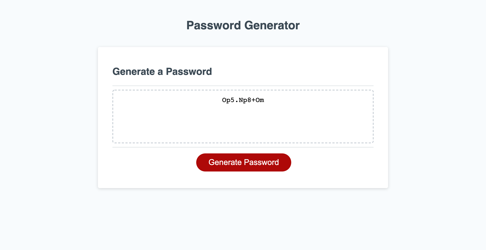

# Password-Generator

GOAL: 

The overall goal of this project was to create a functional password generator. 

I was given some starter code: completed HMTL and CSS code, and some minimal JavaScript code. The assignment was to alter the JavaScript starter code so that the webpage functioned in a way that, when the "Generate Password" button is clicked, the user receives several prompts asking for their desired password length, as well as what types of characters they would like to include in their password: Uppercase letters, lowercase letters, numbers, and/or special characters. 

Once the user goes through all of the options available, a password is generated and displayed in the text area on the webpage or on a separate alert window. 

This is an image of the webpage after I altered the JavaScript code, with a generated password shown on the page:

PROCESS: 

Before altering any of the code, I looked carefully through the HTML code. I opened the webpage and made sure I understood where everything in the code was laid out and to which parts of the webpage all of the classes and ids belonged to. Besides reading through the code, I also used Chrome Dev Tools to help me visualize how the code came to life. I also skimmed through the CSS, but did not spend too much time focusing on styling, as it was completed not essential to the task at hand. 

After looking through the HTML, I looked at the few lines of code in the JavaScript file. I tried wrapping my mind around what this minimal code meant, paying special attention to what sections of the DOM it was already connected to. From there, I started to fill in the page with some pseudo code, which listed tasks I believed should be accomplished to make this password generator functional. 

Before jumping into writing code, I looked over my notes on what we had already learned about JavaScript, in order to better grasp how these concepts would fit into the JavaScript logic. This also gave me a better idea about what I would have to research beyond my notes. 

Once I started actually putting code into the JavaScript file, I consistently used the console in order to log my code, see what worked and what did not, and assess my progress. 

The first coding I wrote was to make sure the "Generate Password" button worked correctly, using eventListener. I then started a generatePassword function that would do just that: generate the password. Within this function there are two main parts: a part that has all of the prompts, and the part that actually generates the password that is going to be shown on the page, given the information provided by the prompts. 

After creating a prompt for each of the password criteria and making sure they worked correctly, I fine-tuned what I wanted the prompts to say and how I wanted them to function. 

The next task was to come up with the right logic within the generatePassword function for making sure that the password had the right number of randomly-picked characters, as chosen by the user. For this, I created a 'for' loop that contained within it many conditional statements. There are separate 'if' statements for each character type offered. The condition was set so that, if a type is selected, a random character is chosen from an available array. The number of times the loop repeats itself is dependent on the length of the password. 

The randomly-picked characters are put into their own array. This array is then converted into a single string. The last part I worked on was returning this string to the text area of the webpage, as the generated password. 

CHALLENGES & IMPROVEMENTS: 

This project was incredibly challenging. Being new to JavaScript, the challenge came from not being familiar with its capabilities and syntax. Because of this, it took a very long time to accomplish each of my goals within this project. My love of math and logic helped me in understanding the concepts and theory, yet when it came time to actually translating it to code, I came across several barriers. That being said, the overall solution to this is practice and research. As with any other language, one only starts becoming comfortable with it when one is immersed in it. 

I did find pseudo coding extremely helpful, as it maps out what is to be done, even if I didn't quite have the language to accomplish the steps right away. I did end up changing up my logic a few times. Before I arrived at something that was not only working, but that I understood fully, I reached out for help from my tutor, classmates, and teachers. This definitely showed me how coding truly has to be a collaborative process. 

The password generator works, yet I think it could use some improvements that I was unable to achieve: 

After a password is generated, the user has to refresh the page in order to generate another password without any errors. It would be more useful for the page to reload on its own after the "Generate Password" button is pressed again.

The password generated is only random in its characters, but not in the order that the character types are shown. This is because the loop follows the order of the conditional statements within it. To maximize the randomness and security of the password, it would be helpful to add code that would once again pick randomly from the created "basket" array of already-picked random character types.  

I would also add a prompt at the end of the other prompts that summarizes/confirms the user's picks. 

CONCLUSION: 

I learned a ton from this project. Not just about the code itself and what it is capable of, but about the process of coding. 

My process for this particular assignment tested my knowledge, my patience, and my self-confidence. However, going through these tests was invaluable for understanding that I can get through these hurdles if I go after the tools and the help that are available to me. I truly discovered the value of being patient and having other sets of eyes looking over my work, as well as taking breaks when exhausted and overwhelmed. Also, Googling is certainly an art form and very useful for coding. 

Once I got through the major hurdles (and I don't think I got through all of them by any means), the work became incredibly rewarding. 

I believe all of these things to be true not just during the process of learning coding in school, but also in the work force. 

To view the password generator, please visit: 

https://mgdelneri.github.io/Password-Generator/

